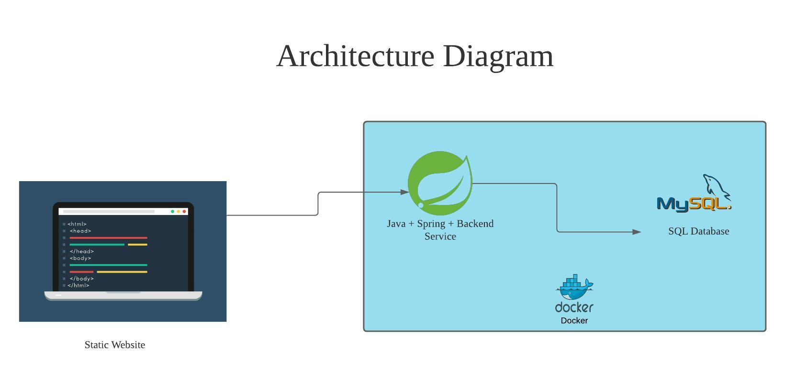
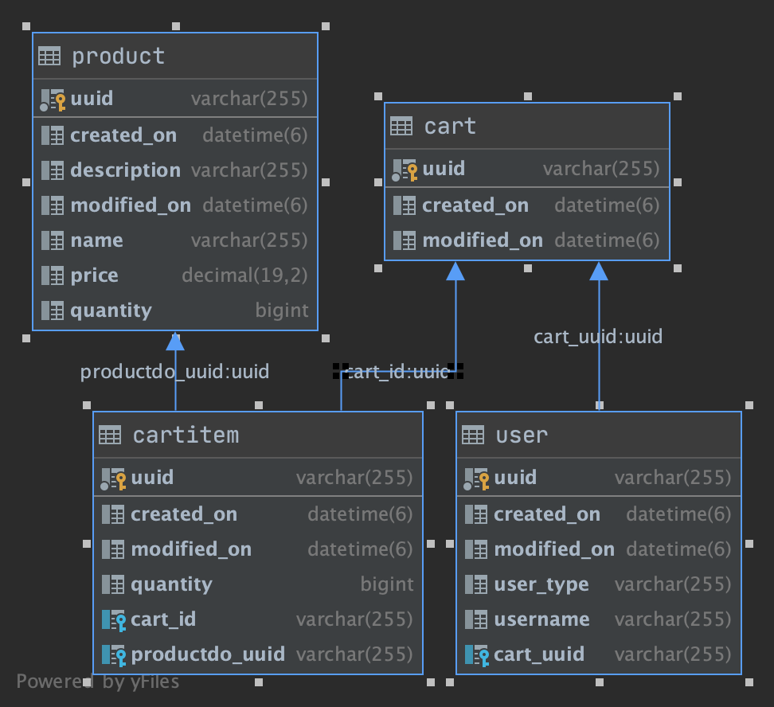

# MVP E-commerce


## About

Ecommerce challenge.


## Pre-requisites

Docker desktop

## Diagrams




## DB Schema


## How to run

#### start containers

```bash
cd mvp-ecommerce
docker-compose -f docker-compose.yml up
```

#### stop containers

```bash
cd mvp-ecommerce
docker-compose -f docker-compose.yml down
```

#### Static website included
```
cd mvp-ecommerce/static-web-page
```
open index.html in Chrome/firefox

#### Rest API's exposed

Please note entire rest collection is available under (importable via insomnia) : 
```
cd mvp-ecommerce/rest-samples
```

1. users -> GET / POST
    ```
   {
   	"username": "user3",
   	"userType": "CUSTOMER"
   }
   ```
2. products -> GET / POST
    ```
   {
   	"name": "APPLE",
   	"description": "lemon",
   	"price": 132,
   	"quantity": 12
   }
   ```
3. users/cart -> GET
4. users/{user_id}/addtocart/{product_id}
5. users/{user_id}/removefromcart/{product_id}

## Code coverage report

| com.dealstop | 93% (15/16) |
| ------------- | ----------- |


## Bonus
1. Github CI-CD
2. Docker build
3. Search enabled in products / cart