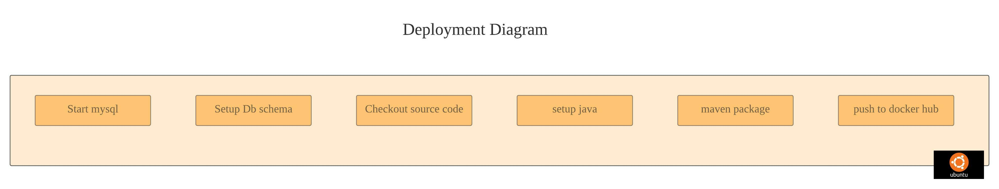

# MVP E-commerce


## About

Ecommerce challenge.


## Pre-requisites

Docker desktop

## Diagrams




## How to run

#### start containers

```bash
cd mvp-ecommerce
docker-compose -f docker-compose.yml up
```

#### stop containers

```bash
cd mvp-ecommerce
docker-compose -f docker-compose.yml down
```

#### Static website included
```
cd mvp-ecommerce/static-web-page
```
open index.html in Chrome/firefox

## Code coverage report

| com.dealstop | 93% (15/16) | 61% (50/81) | 72% (166/228) |
| ------------- | ----------- | ----------- | ----------- |


## Bonus
1. Github CI-CD
2. Docker build
3. Search enabled in products / cart